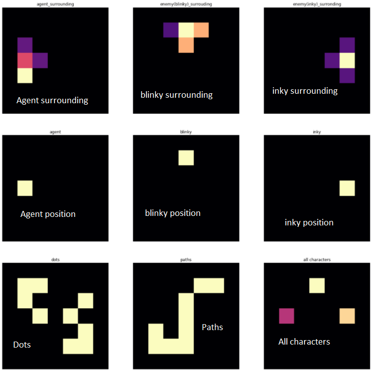

# Reinforcement learning with a3c and cnn

This is a coursework project I developed with [joeyhsiung](https://github.com/joeyhsiung). In this project, we explored how A3C and CNN helps the agent perform in a simplified Pac-Man environment built by us.

## Output

The pink square is Pac-Man, other moving squares are enemies and the purple squares are dots.

## What agent can see

We found that feeding the graph directly to CNN did not yield good result. So we extracted some features from the graph illustrated above and then feed these features into CNN. This gave good result.

## Usage

Please find usage in notebook files in the repo root directory. Model checkpoints are not uploaded due to their size, they can be retrained using the scripts included in this repo.

## required package:
1. pytorch
2. matplotlib
3. python 3.9

